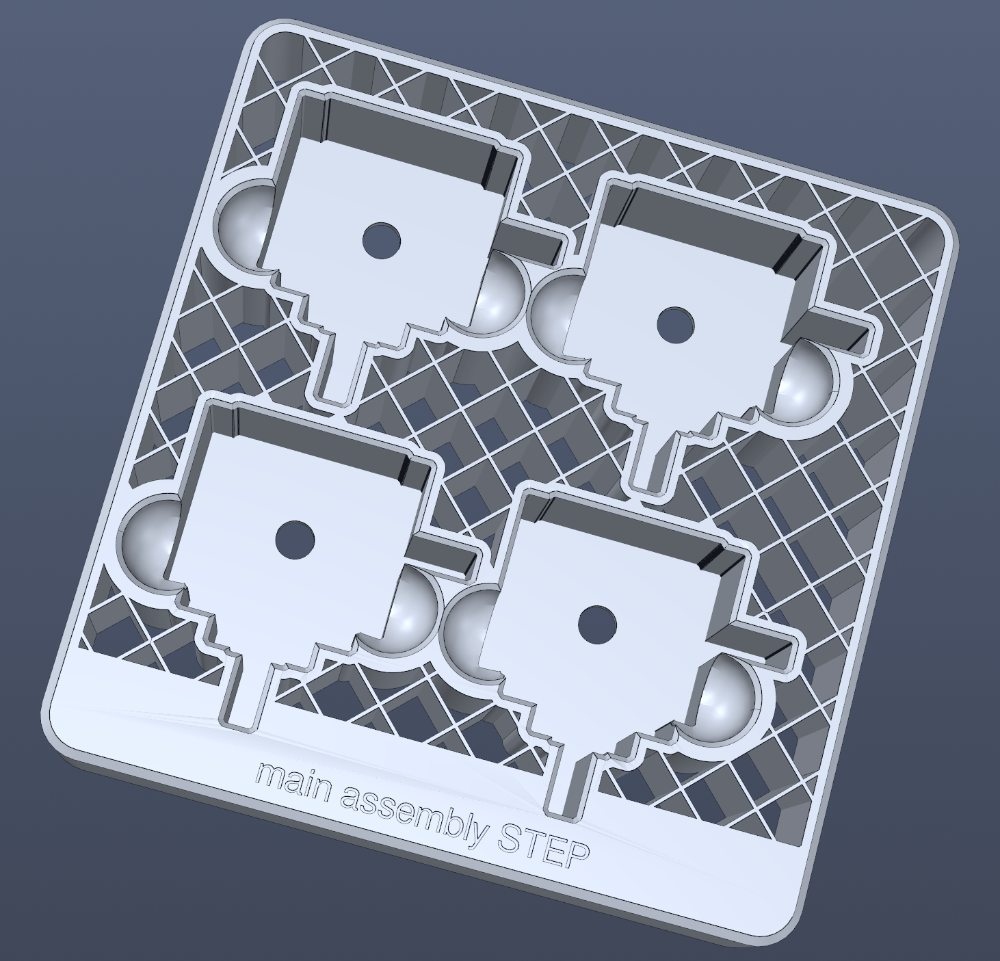

# Parts Packing Generator

## Description

Desktop tool to autogenerate 3D-printable trays to hold parts for storage/shipping. Load a STEP file, generate and export a tray ready for the slicer.

## Features

- TBD

## Requirements

- Linux, Windows, or macOS. Prebuilt binaries need no Python.
- From source: Python 3.10 to 3.12.

## Installation

Download the binary for your OS from [Releases](https://github.com/InPoint-Automation/Parts-Packing-Generator/releases). No Python needed.

- Windows: run `PartsPack.exe`
- Linux: `chmod +x PartsPack-x86_64.AppImage && ./PartsPack-x86_64.AppImage` (may need `libfuse2`)
- macOS: open `PartsPack.app` (unsigned, right-click then Open)

From source: see [DEV.md](DEV.md).

## Usage
Load a STEP part, set parameters in the dock, Preview or Generate, then Export.

## Contributing
Feel free to fork this project or contribute a PR.
Build instructions can be found in the developer readme [DEV.md](DEV.md)

## Licenses

### Main code

This project is licensed under the GPLv3+

See [LICENSE](LICENSE) file for details.

### Third-Party Components

Full license texts for all bundled and depended-on components are in the
[Third Party Licenses](Third%20Party%20Licenses/) directory.

Bundled assets:

- [Lucide](https://github.com/lucide-icons/lucide) - ISC License (portions derived from [Feather](https://github.com/feathericons/feather), MIT) - Toolbar and ribbon icons, recolored at runtime into Qt icons

Runtime dependencies (installed via `pip`, bundled into the binaries Nuitka):

- [build123d](https://github.com/gumyr/build123d) - Apache-2.0 License - STEP file loading and B-rep geometry
- [Shapely](https://github.com/shapely/shapely) - BSD-3-Clause License - 2D footprint and polygon operations
- [PyVista](https://github.com/pyvista/pyvista) - MIT License - 3D mesh rendering and preview
- [pyvistaqt](https://github.com/pyvista/pyvistaqt) - MIT License - Embedding the PyVista viewer in Qt
- [PySide6 (Qt for Python)](https://www.qt.io/qt-for-python) - LGPL-3.0 License - GUI framework. Qt ships several licenses [Third Party Licenses/pyside6](Third%20Party%20Licenses/pyside6/)
- [NumPy](https://github.com/numpy/numpy) - BSD-3-Clause License - Array and numerical operations
- [pydantic](https://github.com/pydantic/pydantic) - MIT License - Parameter models and validation
- [manifold3d](https://github.com/elalish/manifold) - Apache-2.0 License - Mesh boolean operations
- [scikit-image](https://github.com/scikit-image/scikit-image) - BSD-3-Clause License - Heightmap morphology
- [pydelatin](https://github.com/kylebarron/pydelatin) - MIT License - Heightmap-to-mesh conversion (wraps [hmm](https://github.com/fogleman/hmm), MIT)
- [trimesh](https://github.com/mikedh/trimesh) - MIT License - mesh loading and processing (`[mesh]` extra)

## Credits
This project was developed by InPoint Automation Sp. z o.o.
https://inpointautomation.com/

## Changelog
See [CHANGELOG.md](CHANGELOG.md) for the full version history.